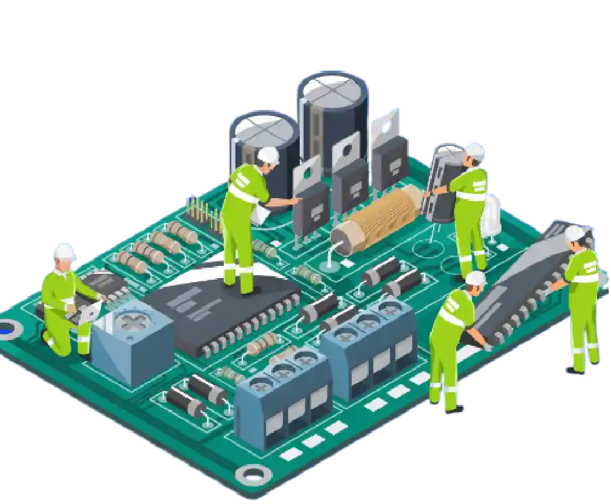

## **Hey there 👋 It's Rahul here**

### 🎯 What Drives Me
- 🌟 Creating smart solutions with Embedded Systems, IoT, and AI/ML technologies
- 💻 Passionate Verilog coder and digital design enthusiast
- 🔧 Experimenting with Single Board Computers (SBCs) and AI applications

---

### 🌱 I’m currently learning
- VLSI Design & ASIC Flow  
- Verilog HDL & FPGA Prototyping  
- STM32, ESP32, and Real-Time Embedded Programming  
- Integrating AI with IoT hardware

---
### 📱 Where to Reach Me
 

---

### 💼 Experience
- Previous Freelance IoT Product Developer for &nbsp; 

---

### 💻 Programming & Hardware Description Languages I Use
 &nbsp;  &nbsp;  &nbsp;  &nbsp; 

---
### 🛠 Tools & IDEs I Use
 &nbsp;  &nbsp;  &nbsp;  &nbsp;  &nbsp;

---
### ⚙️ Other Tools & Platforms
 &nbsp;  &nbsp;  &nbsp;

---
